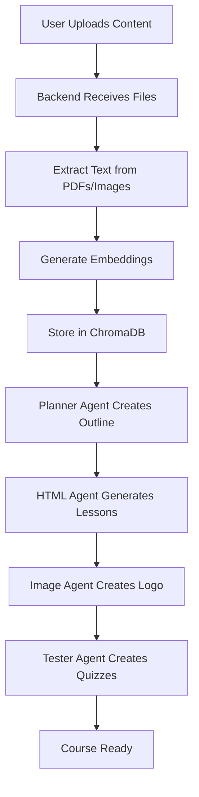
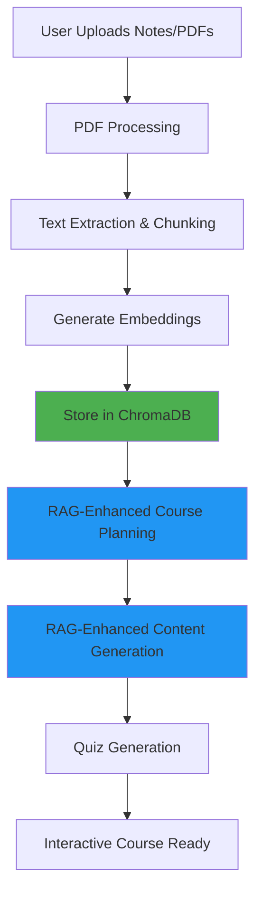
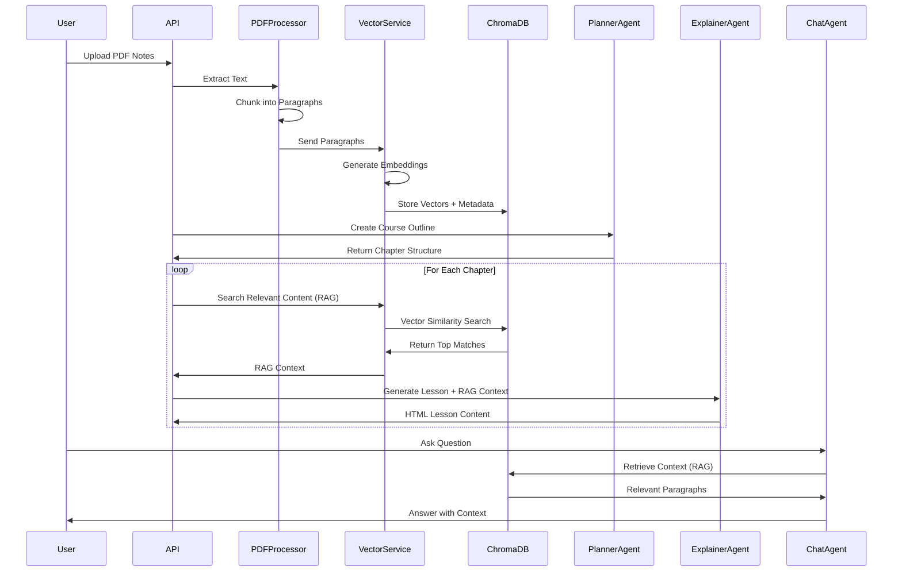

# Nexora AI - Technical Explanation

## Overview

**Nexora AI** is a full-stack AI-powered learning platform designed to revolutionize personalized education. The application allows users to create interactive courses from various media (documents, images, notes), generate AI-assisted quizzes, interact with chapter-specific chatbots, and track their learning progress.

---

## 🏗️ Architecture

Nexora AI follows a **modern three-tier architecture**:

1. **Frontend (Client Layer)** - React-based user interface
2. **Backend (API Layer)** - FastAPI Python server
3. **Database Layer** - MySQL for relational data + ChromaDB for vector embeddings

```
┌─────────────────────────────────────────────────────────────┐
│                        Frontend (React)                      │
│                    Port: 3000 (Development)                  │
└──────────────────────────┬──────────────────────────────────┘
                           │ HTTP/REST API
┌──────────────────────────▼──────────────────────────────────┐
│                    Backend (FastAPI)                         │
│                    Port: 8127 (API Server)                   │
└──────────┬────────────────────────────────┬─────────────────┘
           │                                │
┌──────────▼──────────┐         ┌──────────▼─────────────────┐
│   MySQL Database    │         │  ChromaDB (Vector Store)   │
│   Port: 3306        │         │  Port: 8000                │
└─────────────────────┘         └────────────────────────────┘
```

---

## 🎨 Frontend Technology Stack

### Core Technologies

| Technology | Version | Purpose |
|------------|---------|---------|
| **React** | 18.2.0 | Core UI library for building component-based interfaces |
| **Vite** | 5.4.19 | Modern build tool and development server (faster than Webpack) |
| **React Router DOM** | 6.15.0 | Client-side routing and navigation |
| **Axios** | 1.6.2 | HTTP client for API communication |

### UI Framework & Styling

| Technology | Purpose |
|------------|---------|
| **Tailwind CSS** | 4.1.8 - Utility-first CSS framework for rapid styling |
| **Mantine** | 6.0.20 - Component library providing pre-built UI components (forms, notifications, hooks) |
| **Emotion React** | 11.14.0 - CSS-in-JS library for dynamic styling |
| **Motion** | 12.18.1 - Animation library for smooth transitions and interactions |

### Visualization & Rich Content

| Technology | Purpose |
|------------|---------|
| **React Markdown** | 8.0.7 - Render markdown content |
| **React Syntax Highlighter** | 15.6.1 - Code syntax highlighting |
| **React LaTeX Next** | 3.0.0 - Mathematical equation rendering |
| **Plotly.js** | 3.0.1 - Interactive charts and graphs |
| **Recharts** | 2.15.3 - Additional charting library |
| **Mermaid Diagram** | 1.0.20 - Flowchart and diagram rendering |
| **XYFlow React** | 12.7.0 - Node-based graph visualization |

### Internationalization & Utilities

| Technology | Purpose |
|------------|---------|
| **i18next** | 25.2.1 - Internationalization framework |
| **react-i18next** | 15.5.2 - React bindings for i18next |
| **date-fns** | 4.1.0 - Date manipulation and formatting |
| **html2canvas** | 1.4.1 - Screenshot and PDF generation |
| **jsPDF** | 3.0.1 - PDF document creation |

### State Management

- **React Context API** - Global state management
- **React Hooks** - Local component state
- **Zustand** - Lightweight state management (via dependencies)

---

## ⚙️ Backend Technology Stack

### Core Framework

| Technology | Version | Purpose |
|------------|---------|---------|
| **FastAPI** | 0.115.14 | Modern, high-performance Python web framework with automatic API documentation |
| **Uvicorn** | Latest | ASGI server for running FastAPI applications |
| **Python** | 3.12+ | Programming language |

### Database & ORM

| Technology | Purpose |
|------------|---------|
| **SQLAlchemy** | 2.0.41 - SQL toolkit and ORM for database operations |
| **MySQL Connector** | 9.3.0 - MySQL database driver |
| **aiomysql** | 0.2.0 - Async MySQL driver for better performance |
| **ChromaDB** | 1.0.13 - Vector database for AI embeddings and semantic search |

### Authentication & Security

| Technology | Purpose |
|------------|---------|
| **python-jose** | JWT token creation and validation |
| **passlib** | 1.7.4 - Password hashing (bcrypt) |
| **bcrypt** | 4.0.1 - Secure password hashing algorithm |
| **Authlib** | 1.6.0 - OAuth and authentication library |
| **itsdangerous** | 2.2.0 - Secure data signing |

### AI & Machine Learning

| Technology | Purpose |
|------------|---------|
| **Google ADK** | 1.5.0 - Google AI Development Kit for Gemini API integration |
| **LiteLLM** | 1.72.1 - Unified interface for multiple LLM providers |
| **Sentence Transformers** | 2.2.2+ - Generate text embeddings for semantic search |
| **ChromaDB** | 1.0.13 - Store and query vector embeddings |

### Document Processing

| Technology | Purpose |
|------------|---------|
| **PyMuPDF** | 1.23.0+ - PDF text extraction and processing |
| **pdf2image** | 1.17.0+ - Convert PDF pages to images |
| **Pillow** | 10.0.0+ - Image processing library |

### Task Scheduling & Utilities

| Technology | Purpose |
|------------|---------|
| **APScheduler** | 3.11.0 - Background task scheduling (e.g., cleaning up stuck courses) |
| **python-dotenv** | 1.1.0 - Environment variable management |
| **python-multipart** | 0.0.20 - File upload handling |
| **requests** | 2.32.3 - HTTP library for external API calls |

### Flashcard Generation

| Technology | Purpose |
|------------|---------|
| **genanki** | 0.13.0 - Generate Anki flashcard decks programmatically |
| **matplotlib** | 3.8.0 - Create visualizations for flashcards |

---

## 🤖 AI Agent System

Nexora AI uses a **multi-agent architecture** where specialized AI agents handle different tasks:

### Agent Types

| Agent | Purpose | Location |
|-------|---------|----------|
| **Chat Agent** | Chapter-specific Q&A chatbot | `backend/src/agents/chat_agent/` |
| **Image Agent** | Generate course logos and images | `backend/src/agents/image_agent/` |
| **HTML Agent** | Generate structured HTML content for lessons | `backend/src/agents/html_agent/` |
| **Explainer Agent** | Create detailed explanations of topics | `backend/src/agents/explainer_agent/` |
| **Planner Agent** | Generate study plans and course outlines | `backend/src/agents/planner_agent/` |
| **Tester Agent** | Create quizzes (MCQ and fill-in-the-blank) | `backend/src/agents/tester_agent/` |
| **Grader Agent** | Evaluate quiz answers and provide feedback | `backend/src/agents/grader_agent/` |
| **Flashcard Agent** | Generate Anki flashcard decks | `backend/src/agents/flashcard_agent/` |
| **Info Agent** | Extract and summarize information | `backend/src/agents/info_agent/` |
| **Code Checker** | Validate code snippets in courses | `backend/src/agents/code_checker/` |

### How Agents Work

1. **User uploads content** (PDF, images, text)
2. **Backend processes the content** and extracts text
3. **Content is embedded** using Sentence Transformers
4. **Embeddings are stored** in ChromaDB for semantic search
5. **Specialized agents** are invoked based on user actions:
   - Creating a course → Planner Agent + HTML Agent
   - Asking questions → Chat Agent (retrieves relevant context from ChromaDB)
   - Taking a quiz → Tester Agent + Grader Agent
   - Generating flashcards → Flashcard Agent

---

## 🗄️ Database Schema

### MySQL (Relational Data)

Stores structured data such as:
- **Users** - Authentication and profile information
- **Courses** - Course metadata, status, and relationships
- **Chapters** - Course content organization
- **Questions** - Quiz questions and answers
- **User Progress** - Tracking learning progress
- **Notes** - User-created notes
- **Files** - Uploaded documents and media

### ChromaDB (Vector Database)

Stores:
- **Text embeddings** from course content
- **Semantic search indices** for AI chatbot context retrieval
- **Document chunks** with metadata for efficient retrieval

---

## 🔄 Course Creation Workflow



### Step-by-Step Process

1. **Upload** - User uploads documents, images, or text
2. **Processing** - Backend extracts text using PyMuPDF and OCR
3. **Embedding** - Text is converted to vector embeddings
4. **Storage** - Embeddings stored in ChromaDB, metadata in MySQL
5. **Planning** - Planner Agent creates course structure
6. **Content Generation** - HTML Agent generates lesson content
7. **Visual Assets** - Image Agent creates course logo via Google Vertex AI
8. **Assessment** - Tester Agent generates quizzes
9. **Finalization** - Course status updated to "READY"

---

## 🔐 Authentication Flow

1. **User Registration**
   - Frontend sends credentials to `/api/auth/register`
   - Backend hashes password with bcrypt
   - User stored in MySQL database

2. **User Login**
   - Frontend sends credentials to `/api/auth/login`
   - Backend validates password
   - JWT token generated and returned
   - Token stored in browser (localStorage/cookies)

3. **Authenticated Requests**
   - Frontend includes JWT token in `Authorization` header
   - Backend validates token using `python-jose`
   - User identity extracted from token

---

## 🌐 API Structure

### Main API Routers

| Router | Endpoint Prefix | Purpose |
|--------|----------------|---------|
| **auth** | `/api/auth` | User registration, login, logout |
| **users** | `/api/users` | User profile management |
| **courses** | `/api/courses` | Course CRUD operations |
| **files** | `/api/files` | File upload and management |
| **chat** | `/api/chat` | AI chatbot interactions |
| **questions** | `/api/questions` | Quiz questions and answ  ers |
| **flashcard** | `/api/flashcard` | Flashcard generation and download |
| **notes** | `/api/notes` | User notes management |
| **statistics** | `/api/statistics` | Learning analytics |
| **search** | `/api/search` | Semantic search across courses |

### API Documentation

FastAPI automatically generates interactive API documentation:
- **Swagger UI**: `http://localhost:8127/docs`
- **ReDoc**: `http://localhost:8127/redoc`

---

## 🚀 Development Workflow

### Running Locally

**Prerequisites:**
- Python 3.12+
- Node.js 18+
- MySQL 8.0+
- Docker (for ChromaDB)

**Backend Setup:**
```bash
cd backend
python -m venv venv
.\venv\Scripts\activate  # Windows
pip install -r requirements.txt
uvicorn src.main:app --reload --port 8127
```

**Frontend Setup:**
```bash
cd frontend
npm install
npm run dev
```

**ChromaDB Setup:**
```bash
docker run -d -p 8000:8000 chromadb/chroma:latest
```

### Environment Variables

Create a `.env` file in the backend directory:

```env
# Database
DB_USER=nexora_user
DB_PASSWORD=your_password
DB_HOST=localhost
DB_PORT=3306
DB_NAME=nexora_db

# Security
SECRET_KEY=your-secret-key
SESSION_SECRET_KEY=your-session-key

# ChromaDB
CHROMA_DB_URL=http://localhost:8000

# Google AI (for image generation)
GOOGLE_API_KEY=your-google-api-key
```

---

## 📦 Build & Deployment

### Frontend Build

```bash
cd frontend
npm run build
```

This creates an optimized production build in the `dist/` folder using Vite.

### Backend Deployment

The backend can be deployed using:
- **Docker** - Containerized deployment
- **Gunicorn** - Production ASGI server
- **Nginx** - Reverse proxy (configuration in `.nginx` file)

### Docker Deployment

```bash
docker-compose up -d
```

This starts:
- MySQL database
- ChromaDB vector store
- FastAPI backend
- Nginx reverse proxy

---

## 🔍 Key Features Implementation

### 1. AI-Powered Course Generation

**Technologies Used:**
- Google Gemini API (via Google ADK)
- LiteLLM for model abstraction
- ChromaDB for context retrieval

**Process:**
1. User uploads content
2. Content is chunked and embedded
3. Planner Agent creates course outline
4. HTML Agent generates lesson HTML
5. Content stored in MySQL

### 2. Semantic Search & Chatbot

**Technologies Used:**
- Sentence Transformers for embeddings
- ChromaDB for vector similarity search
- Chat Agent for response generation

**Process:**
1. User asks a question
2. Question is embedded
3. ChromaDB finds relevant course content
4. Chat Agent generates answer with context

### 3. Quiz System

**Technologies Used:**
- Tester Agent for question generation
- Grader Agent for answer evaluation
- React forms for UI

**Process:**
1. Tester Agent generates MCQ and fill-in-the-blank questions
2. Questions stored in MySQL
3. User submits answers
4. Grader Agent evaluates and provides feedback

### 4. Flashcard Generation

**Technologies Used:**
- Flashcard Agent
- genanki library
- Anki deck format

**Process:**
1. User requests flashcards for a chapter
2. Flashcard Agent extracts key concepts
3. genanki generates `.apkg` file
4. User downloads and imports into Anki

### 5. Multilingual Support

**Technologies Used:**
- i18next
- react-i18next
- Language detection

**Implementation:**
- Translation files in `frontend/src/i18n/`
- Automatic language detection
- User can switch languages in settings

---

## 🎯 Performance Optimizations

### Frontend
- **Code Splitting** - Vite automatically splits code
- **Lazy Loading** - Components loaded on demand
- **Memoization** - React.memo and useMemo for expensive computations
- **Virtual Scrolling** - For long lists

### Backend
- **Async Operations** - FastAPI with async/await
- **Connection Pooling** - aiomysql for database connections
- **Caching** - ChromaDB caches embeddings
- **Background Tasks** - APScheduler for cleanup jobs

---

## 🛡️ Security Measures

1. **Password Hashing** - bcrypt with salt
2. **JWT Tokens** - Secure authentication
3. **CORS Protection** - Restricted origins
4. **SQL Injection Prevention** - SQLAlchemy ORM
5. **Input Validation** - Pydantic models
6. **Session Management** - Secure session middleware

---

## 📊 Monitoring & Maintenance

### Background Tasks

- **Stuck Course Cleanup** - APScheduler runs periodic checks
- **Session Cleanup** - Remove expired sessions
- **Database Optimization** - Index maintenance

### Logging

- FastAPI built-in logging
- Custom logging for AI agents
- Error tracking and debugging

---

## 🔮 Future Enhancements

- [ ] Progress/Statistics Dashboard
- [ ] Offline Mode (PWA)
- [ ] Collaborative Course Editing
- [ ] Mobile App (React Native)
- [ ] Advanced Analytics
- [ ] Gamification Features

---

## 📚 Summary

**Nexora AI** is a sophisticated learning platform that combines:

- **Modern Web Technologies** (React, FastAPI, Vite)
- **AI/ML Capabilities** (Google Gemini, Sentence Transformers, ChromaDB)
- **Robust Architecture** (Three-tier, microservices-style agents)
- **Rich User Experience** (Interactive UI, visualizations, multilingual)
- **Scalable Design** (Docker, async operations, vector databases)

The platform demonstrates best practices in:
- Full-stack development
- AI integration
- Database design
- Security
- User experience
- Performance optimization

---

## 🔬 Deep Dive: How Notes Become Intelligent Courses

### The Complete Pipeline

When a user uploads their notes (PDFs, images, or text), Nexora AI transforms them into structured, interactive courses through a sophisticated multi-stage pipeline:



### Stage 1: Document Processing & Text Extraction

**File:** `backend/src/services/data_processors/pdf_processor.py`

When a PDF is uploaded, the system:

1. **Extracts Raw Text** using PyMuPDF (fitz)
   ```python
   doc = fitz.open(stream=file_data, filetype="pdf")
   page_text = page.get_text()
   ```

2. **Intelligently Chunks into Paragraphs**
   - Splits on double line breaks (`\n\n`)
   - Removes headers/footers (paragraphs < 50 characters)
   - Normalizes whitespace
   - Preserves semantic meaning

3. **Creates Structured Metadata**
   ```python
   {
       "text": "Machine learning is...",
       "page_number": 5,
       "paragraph_index": 2,
       "word_count": 127
   }
   ```

**Why This Matters:** Proper chunking ensures that related concepts stay together, making RAG retrieval more accurate.

---

### Stage 2: Embedding Generation & Vector Storage

**File:** `backend/src/services/vector_service.py`

Each paragraph is converted into a **vector embedding** - a mathematical representation of its meaning.

#### How It Works:

1. **Generate Embeddings** using Sentence Transformers
   ```python
   embedding_model = SentenceTransformer('all-MiniLM-L6-v2')
   embedding = embedding_model.encode([text])
   ```

2. **Store in ChromaDB** with Rich Metadata
   ```python
   self.vector_service.add_content_by_course_id(
       course_id=course_id,
       content_id="doc_123_page_5_para_2",
       text=paragraph_text,
       metadata={
           "type": "pdf_paragraph",
           "document_id": 123,
           "filename": "machine_learning_notes.pdf",
           "page_number": 5,
           "paragraph_index": 2,
           "word_count": 127
       }
   )
   ```

**Key Technology:**
- **Model:** `all-MiniLM-L6-v2` - Fast, efficient, 384-dimensional embeddings
- **Database:** ChromaDB - Purpose-built for vector similarity search
- **Collection Structure:** One collection per course (`course_{id}`)

---

### Stage 3: RAG (Retrieval-Augmented Generation)

**RAG** is the secret sauce that makes Nexora AI's courses so accurate and relevant. Instead of relying solely on the AI's general knowledge, RAG **retrieves relevant content from your uploaded notes** and provides it as context to the AI.

#### What is RAG?

**Retrieval-Augmented Generation** combines:
1. **Retrieval** - Finding relevant information from your notes
2. **Augmentation** - Adding that information as context
3. **Generation** - AI creates content based on both its knowledge AND your notes

#### How RAG Works in Nexora AI

**File:** `backend/src/services/course_content_service.py`

```python
def get_rag_infos(self, course_id: int, topic: dict):
    """
    Retrieve relevant content from uploaded notes for a specific topic.
    """
    ragInfos = set()
    
    # Search for content related to chapter caption
    queryRes = self.vector_service.search_by_course_id(
        course_id, 
        topic['caption'], 
        n_results=2
    )
    
    # Search for content related to each subtopic
    for content in topic['content']:
        queryRes = self.vector_service.search_by_course_id(
            course_id, 
            content, 
            n_results=3
        )
        
    return list(set(ragInfos))
```

#### The RAG Process Step-by-Step:

1. **User Query/Topic** → "Neural Networks"

2. **Convert to Embedding**
   ```python
   query_embedding = embedding_model.encode(["Neural Networks"])
   ```

3. **Vector Similarity Search** in ChromaDB
   - Finds paragraphs with similar semantic meaning
   - Uses cosine similarity to rank results
   - Returns top N most relevant chunks

4. **Retrieved Context** (Example)
   ```
   [
       "Neural networks consist of layers of interconnected nodes...",
       "Backpropagation is the algorithm used to train neural networks...",
       "Activation functions introduce non-linearity into the network..."
   ]
   ```

5. **Augmented Prompt** sent to AI
   ```
   CONTEXT FROM USER'S NOTES:
   - Neural networks consist of layers of interconnected nodes...
   - Backpropagation is the algorithm used to train neural networks...
   
   TASK: Create a comprehensive lesson on Neural Networks
   LANGUAGE: English
   DIFFICULTY: Intermediate
   ```

6. **AI Generates Content** using both:
   - Its pre-trained knowledge
   - **Your specific notes** (ensuring accuracy and relevance)

---

### Stage 4: Course Structure Generation

**File:** `backend/src/services/agent_service.py`

The **Planner Agent** creates the course outline:

```python
response_planner = await self.planner_agent.run(
    user_id=user_id,
    state=course_state,
    content=query_with_documents
)

# Returns:
{
    "chapters": [
        {
            "caption": "Introduction to Neural Networks",
            "content": ["Neurons", "Layers", "Activation Functions"],
            "time": 45  # minutes
        },
        {
            "caption": "Training Neural Networks",
            "content": ["Backpropagation", "Gradient Descent", "Loss Functions"],
            "time": 60
        }
    ]
}
```

---

### Stage 5: RAG-Enhanced Content Generation

For **each chapter**, the system:

1. **Retrieves Relevant Content** using RAG
   ```python
   ragInfos = self.contentService.get_rag_infos(course_id, topic)
   ```

2. **Sends to Explainer Agent** with context
   ```python
   response_code = await self.coding_agent.run(
       user_id=user_id,
       state=course_state,
       content=query_with_rag_context
   )
   ```

3. **Generates HTML Lesson** grounded in your notes
   ```html
   <div class="lesson">
       <h2>Introduction to Neural Networks</h2>
       <p>Based on your notes: Neural networks consist of...</p>
       <code>// Example from your materials</code>
   </div>
   ```

---

### Stage 6: Intelligent Chatbot with RAG

**File:** `backend/src/services/chat_service.py`

When a student asks a question in a chapter:

1. **Question:** "How does backpropagation work?"

2. **Retrieve Chapter Content** (already stored with RAG context)
   ```python
   chapter_content = chapter.content  # HTML with embedded knowledge
   ```

3. **Chat Agent** uses this as context
   ```python
   async for text_chunk in self.chat_agent.run(
       user_id=user_id,
       state={"chapter_content": chapter_content},
       content=user_question
   ):
       yield text_chunk
   ```

4. **Response** is grounded in:
   - The chapter content (which was RAG-enhanced)
   - The user's original notes
   - The AI's general knowledge

---

### Why RAG is Critical

| Without RAG | With RAG |
|-------------|----------|
| AI uses only general knowledge | AI uses **your specific notes** |
| May include irrelevant information | Focused on **your course material** |
| Generic explanations | **Personalized** to your content |
| Potential hallucinations | Grounded in **actual documents** |
| One-size-fits-all | **Customized** to your learning style |

---

### Real-World Example

**User Uploads:** A PDF on "Quantum Computing Basics"

**Without RAG:**
- AI generates generic quantum computing course
- May miss specific concepts from the PDF
- Could contradict the uploaded material

**With RAG:**
1. PDF is chunked into 47 paragraphs
2. Each paragraph embedded and stored in ChromaDB
3. When creating "Quantum Superposition" chapter:
   - RAG retrieves: "Superposition allows qubits to exist in multiple states..."
   - AI generates lesson **using this exact explanation**
4. Student asks: "What's a qubit?"
   - RAG finds relevant paragraph from page 3
   - Chatbot answers **using the PDF's definition**

**Result:** A course that perfectly matches the user's uploaded material!

---

### Performance Optimizations

1. **Parallel Processing**
   ```python
   # Process all chapters concurrently
   chapter_tasks = [
       process_chapter(idx, topic) 
       for idx, topic in enumerate(chapters)
   ]
   await asyncio.gather(*chapter_tasks)
   ```

2. **Efficient Embeddings**
   - Model: `all-MiniLM-L6-v2` (fast, lightweight)
   - Batch processing for multiple paragraphs
   - Cached in ChromaDB for instant retrieval

3. **Smart Chunking**
   - Minimum 50 characters (filters noise)
   - Preserves semantic boundaries
   - Metadata for precise retrieval

---

### Technical Stack Summary

| Component | Technology | Purpose |
|-----------|------------|---------|
| **PDF Processing** | PyMuPDF (fitz) | Extract text from PDFs |
| **Text Chunking** | Regex + Custom Logic | Split into semantic paragraphs |
| **Embeddings** | Sentence Transformers | Convert text to vectors |
| **Vector Database** | ChromaDB | Store and search embeddings |
| **Similarity Search** | Cosine Similarity | Find relevant content |
| **AI Agents** | Google Gemini API | Generate course content |
| **Orchestration** | FastAPI + AsyncIO | Coordinate the pipeline |

---

### Code Flow Diagram



---

### Key Takeaways

1. **Notes → Structured Data:** PDFs are intelligently chunked and embedded
2. **RAG = Accuracy:** Every lesson is grounded in your uploaded material
3. **Vector Search = Speed:** ChromaDB finds relevant content in milliseconds
4. **AI + Your Content = Perfect Course:** Combines AI capabilities with your specific knowledge
5. **Chatbot Memory:** Every question is answered using your original notes

This is how Nexora AI transforms simple notes into intelligent, interactive, and **personalized** learning experiences! 🎓✨

---

**Made with 💡 and 🧠 by the Nexora AI Team**
